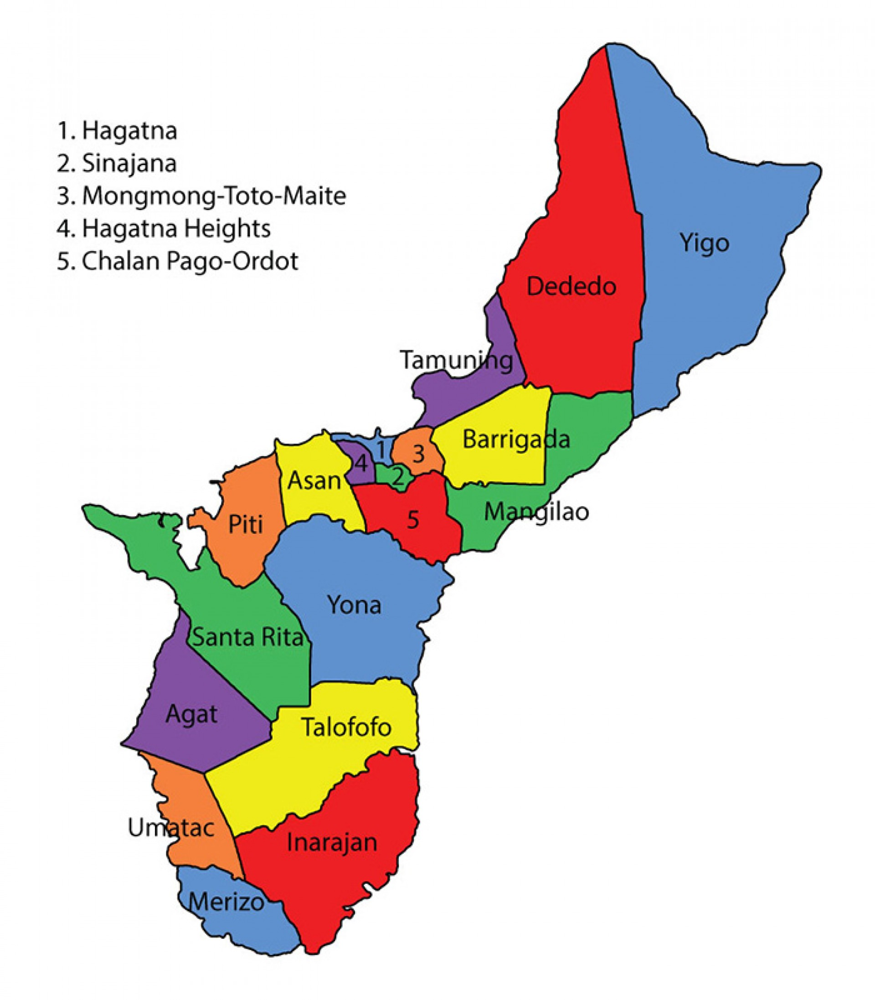
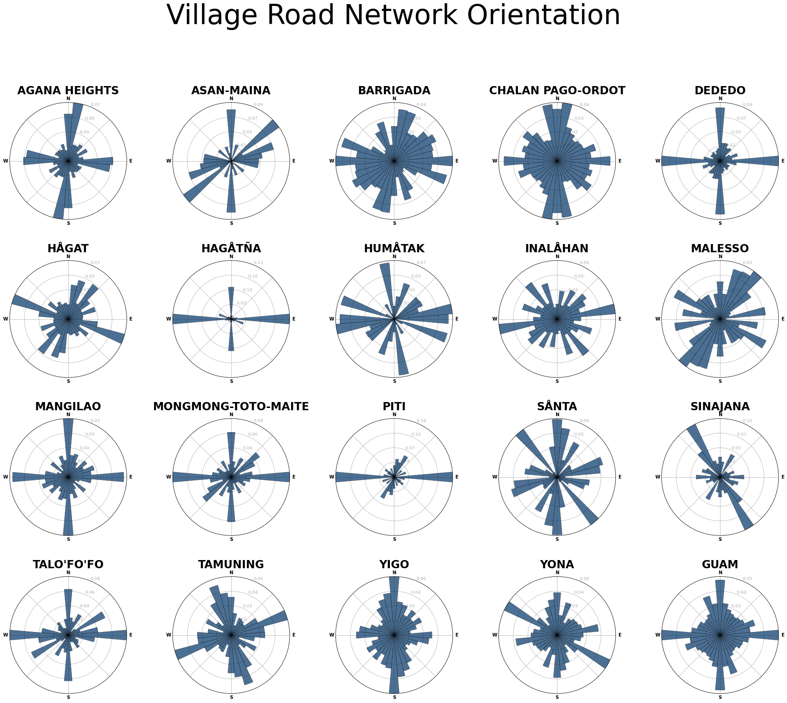

# Day 10 - Experimental

The first map is a municipality map showing the boundaries of Guam's 19 villages.
This map was found online and can be used for reference.

The polar histogram plots show the road bearing distribution in bins of 10
degrees by village. The distribution accounts for road length and the plots
scale the maximum bearing bin to the outer-most ring.

[Jupyter Notebook](day10.ipynb)

