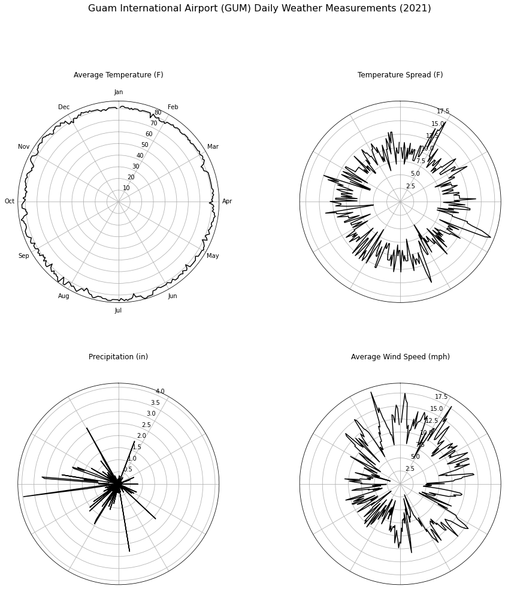

# Day 11 - Circular

The chart is a polar line plot of the average temperature, temperature span
(max temp - min temp), total precipitation, and average wind speed for each
day in 2021 on Guam. An animated version is also included.

[Jupyter Notebook](day11.ipynb)

