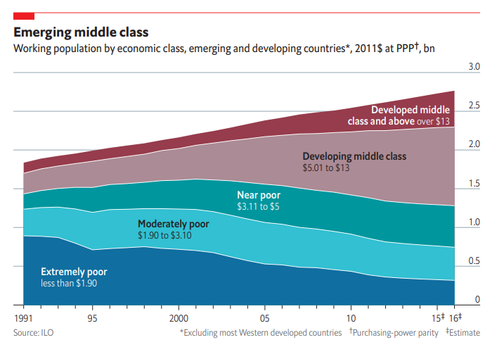
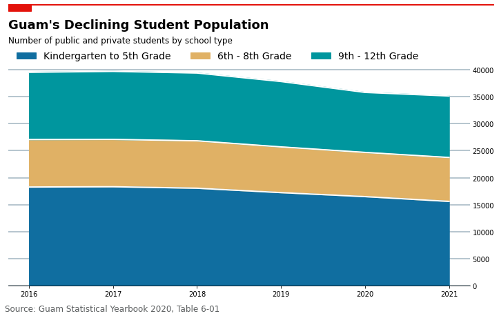

# Day 12 - The Economist

The first chart is an example of a stacked area chart from The Economist.

The second chart is my attempt at an Economist-style chart showing the declining
student population across all school types despite an increasing population.

[Jupyter Notebook](day12.ipynb)

