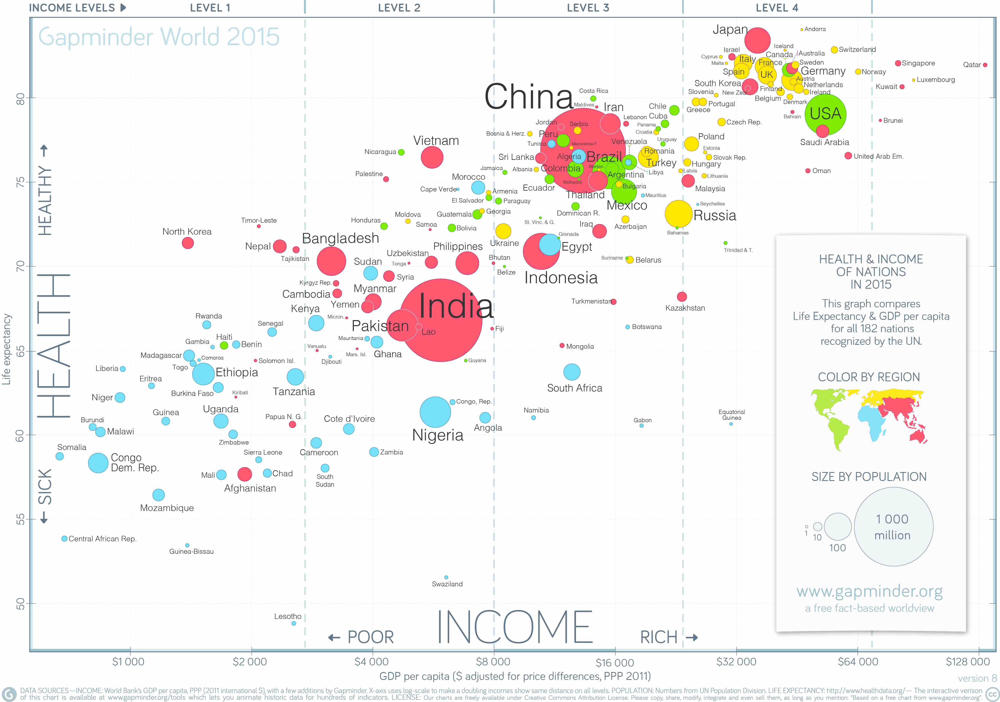
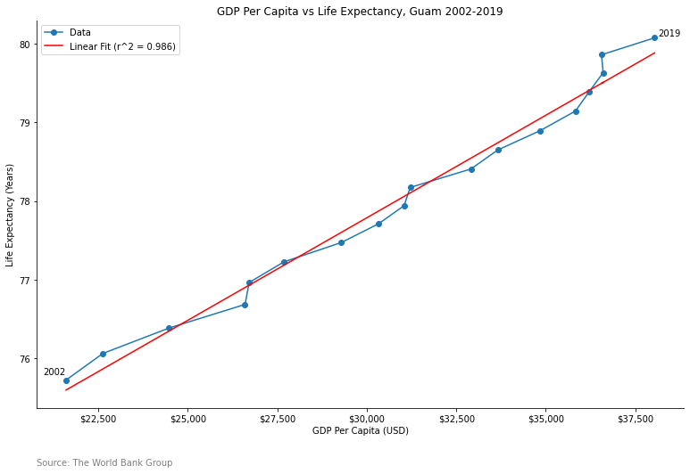

# Day 13 - Correlation

The first chart is the latest Gapminder 'Health/Wealth' scatter plot from 2016.
It shows the GDP Per Capita vs Life Expectancy of 182 nations.

The second chart is a stripped down line chart showing the GDP per Capita vs
Life Expectancy from 2002 to 2019. A linear fit line is projected over the 
data along with an R-squared value.

[Jupyter Notebook](day13.ipynb)

