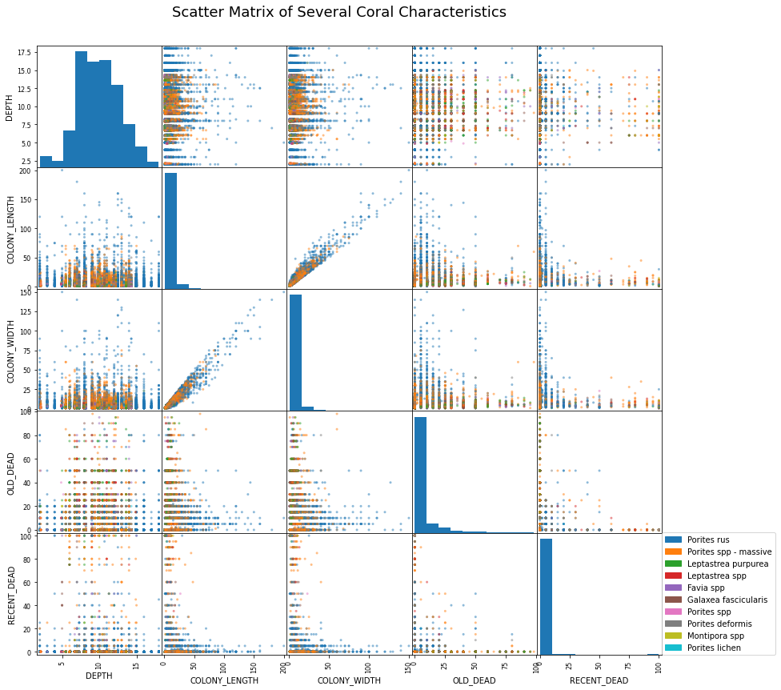
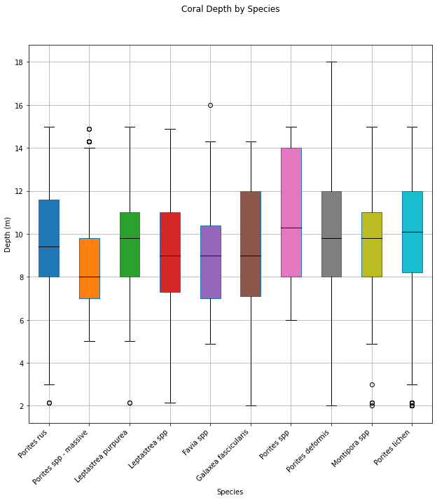

# Day 13 - Multivariate

The first chart is a scatter matrix of coral characteristics, color-coded by
species. A strong correlation is seen between colony length and colony width.
There also appears to be preferred depths to different species of coral, centered
around 10 meters.

The second chart is a box plot of the different coral species and their depths.
Box plots contains the mean and quartile values for each species.

[Jupyter Notebook](day15.ipynb)

