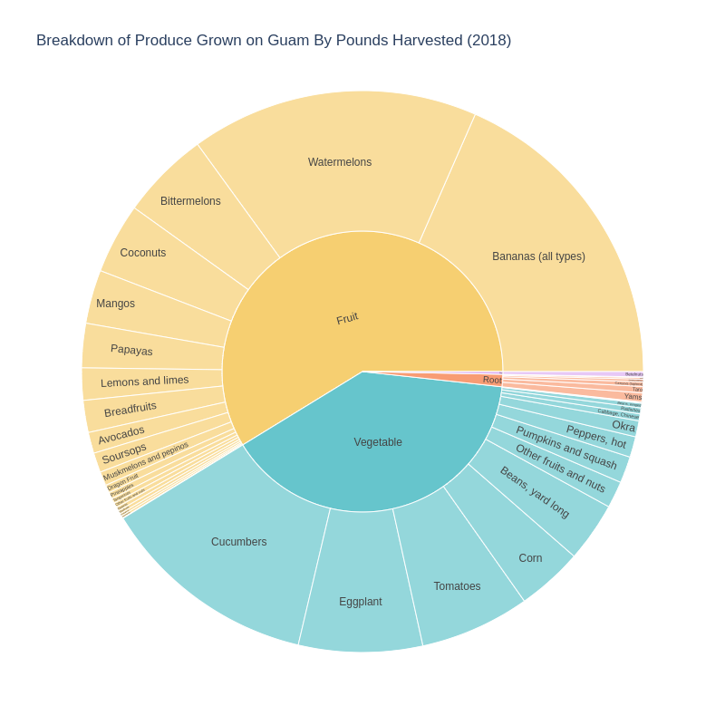
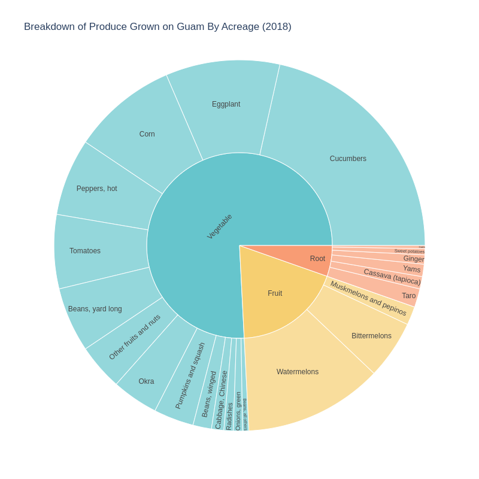
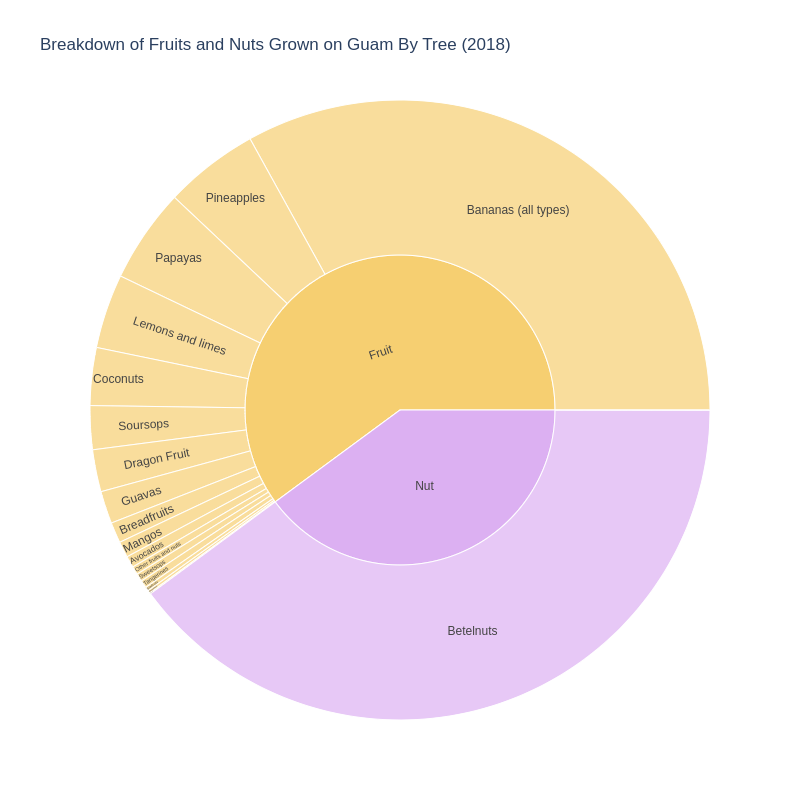
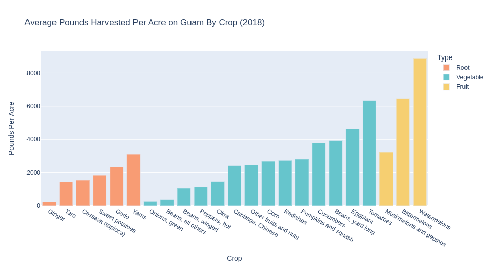
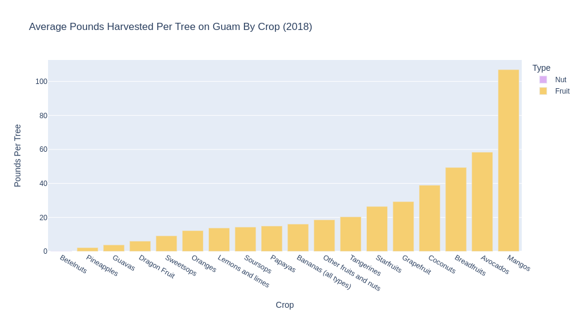

# Day 4 - Flora

A series of sunburst/stacked pie charts and bar charts of Guam's grown produce
in 2018. It is categorized by type (fruit, nut, vegetable, root) and crop.

Crops are plotted as a function of pounds produced. Ground crops are plotted
against total acres used, and pounds harvested per acre per crop. Tree crops are
plotted against total trees, and pounds harvested per acre per tree.

[Jupyter Notebook](day4.ipynb)

