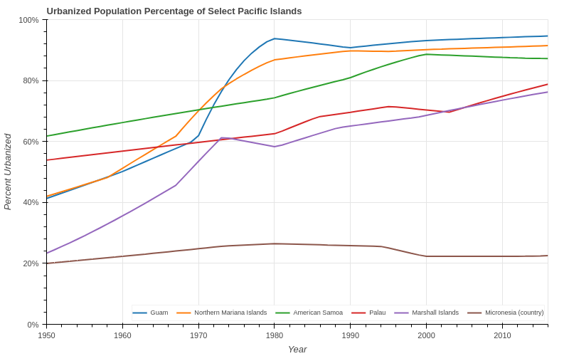
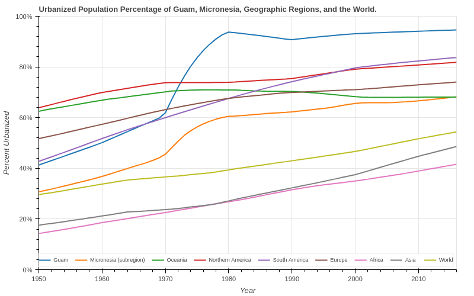

# Day 6 - Our World In Data

Two multi-line charts displaying Guam's urbanization percentage from 1950 until
2016. The first chart compares Guam versus its Pacific Island neighbors. The
second chart compares Guam versus the Micronesia region average, each continent's
average including Oceania, and the World average.

[Jupyter Notebook](day6.ipynb)

