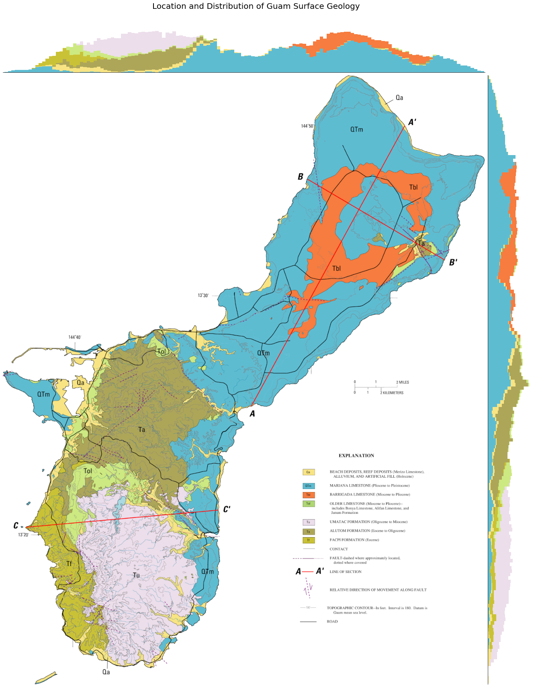

# Day 7 - Physical

The first map displays a geological map of Guam with added latitudinal and 
longitudinal histograms. The original map is from a USGS hydrological survey.

The second map shows the mean location and proportional distribution of the
geological surface geology superimposed over an outline of Guam. The surface
area of each circle is equivalent to the surface area each category inhabits
on Guam.

[Jupyter Notebook](day7.ipynb)

