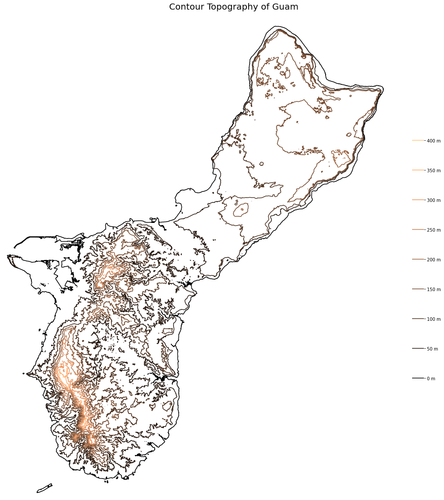

# Day 8 - Mountain

The first map displays the topography of Guam along with the latitudinal and longitudinal profiles of its highest elevations.

The second map shows the topography of Guam through contour lines separated by 50 meters.

The third map shows the elevation change (slope) of Guam.

[Jupyter Notebook](day8.ipynb)

