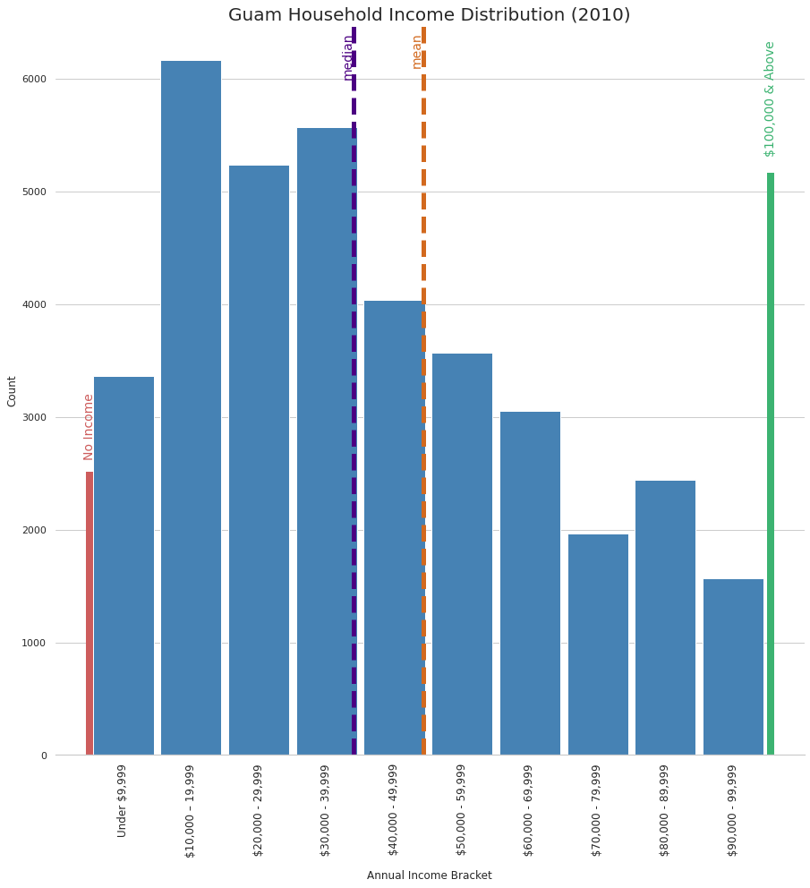

# Day 9 - Statistics

The first bar plot shows the number of households in 2001 with income separated into several income brackets, as well as the median and mean household incomes.

The second bar plot shows the number of households in 2010 with income separated into several income brackets, as well as the median and mean household incomes.

The third bar plot shows the difference in household count from 2001 to 2010. The previous income brackets were reused.

The fourth bar plot shows the percent difference in median and mean household income from 2001 to 2010, along with cumulative inflation during that period. It is clear that household income increases did not keep up with inflation within that period.

[Jupyter Notebook](day9.ipynb)

